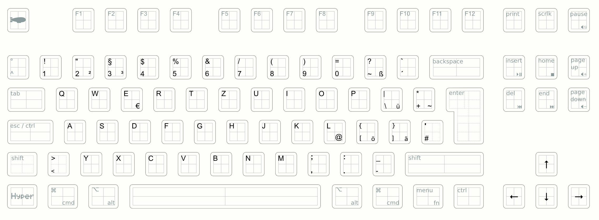

# Keyboard related stuff

In here I will collect everything I need to modify my keyboard to my
needs.

My keyboard is inspired by the article [A modern space
cadet](http://stevelosh.com/blog/2012/10/a-modern-space-cadet/) by Steve
Losh. Caps Lock is mapped to Esc when pressing it shortly, and CTRL if
pressed longer. For this I am using a [fork of Karabiner-Elements](https://github.com/wwwjfy/Karabiner-Elements/releases)
and [this configuration](karabiner/karabiner.json)

I used a german keyboard layout as a start, but modified it a bit.

* [First blogpost about the keyboard](http://bitboxer.de/2015/02/15/keyboard/)
* [A few hints about my keyboard setup](https://bitboxer.de/2015/02/21/shortcutting/)
* [de-coding keyboard layout](https://github.com/bitboxer/de-coding.keylayout)
* [Photos of the keyboard](https://www.flickr.com/photos/wannawork/sets/72157650417820400)
* [The keyboard in the wasd shop](http://www.wasdkeyboards.com/index.php/products/mechanical-keyboard/wasd-v2-88-key-iso-custom-mechanical-keyboard.html)
* [WASD V2 88-Key ISO Custom Layout](v1-layout.svg)
* [My settings](karabiner/) for [Karabiner-Elements](https://pqrs.org/osx/karabiner/)

This is how my layout currently looks like:

Maybe this can inspire you to create your own layout.
